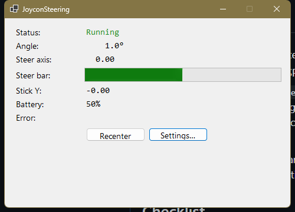
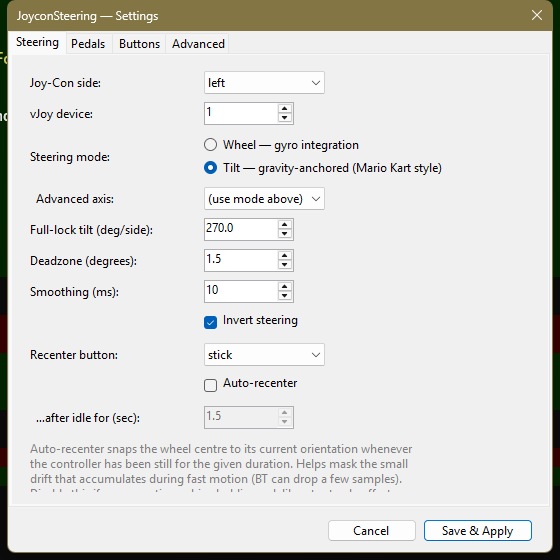

# JoyconSteering

> ⚠️ **Vibe-coded.** This was hacked together end-to-end with an AI coding
> assistant rather than carefully designed up front. The starting goal was
> narrow — get Nintendo Switch Joy-Cons working as a steering wheel + pedals
> for **Forza Horizon 5 and 6** on PC, including the Xbox Game Pass /
> Microsoft Store builds that don't accept third-party controller drivers
> through Steam Input. In practice it should work for any PC racing game
> that accepts a generic DirectInput controller (the vJoy device it
> exposes). The architecture is reasonable, but treat it accordingly.

Turn one Nintendo Switch Joy-Con (left or right — your choice) into a
**steering wheel** for PC racing games, and optionally use the second
Joy-Con as **throttle/brake** pedals (analog stick, assignable buttons, or
gravity-anchored tilt). Targets games that don't natively support Joy-Cons,
particularly the Xbox Game Pass / Microsoft Store version of **Forza
Horizon 5/6**, but works with anything that accepts a generic DirectInput
controller.

Tilt the steering Joy-Con left or right; the game sees a proper wheel axis.
Unlike BetterJoy's gyro-to-stick mode, this is **position-based** — hold
the controller at 45° and the wheel stays at 45°, instead of springing
back to centre. With a second Joy-Con paired you also get true analog
throttle and brake.

## Why this exists

Existing free tools (BetterJoy, JoyShockMapper) can route Joy-Con gyro to a
joystick axis, but they map angular *velocity* — turn the Joy-Con and the
stick moves; stop turning and the stick centres again. That feels wrong in a
driving game. This tool integrates the gyro into an *angle* and outputs that
angle as a wheel axis, which is what a real wheel does.

## Status

Working build with full test coverage of the non-hardware code (parser,
sensor fusion, steering math, output routing). The hardware path (Bluetooth
HID → vJoy driver) is in place but needs a real Joy-Con to validate.

## Screenshots

The live diagnostics window (auto-opens on launch; double-click the tray
icon to re-show after minimising):



The Settings dialog — pick **Wheel** (gyro-integrated, position-based) or
**Tilt** (gravity-anchored, "Mario Kart" style, drift-free), set your
full-lock tilt angle, button map, etc. Save & Apply hot-reloads the
running pipeline:



## Quick install (prebuilt)

1. Grab the latest **`JoyconSteering.exe`** from the
   [Releases page](https://github.com/xfxf/joycon-steering/releases). It's a
   self-contained Windows x64 build — no .NET install required.
2. Install **vJoy** from <https://sourceforge.net/projects/vjoystick/>.
   Open **Configure vJoy**, ensure **Device 1** has axes **X**, **Y**, **Rz**
   enabled and **≥ 16 buttons**, click **Apply**.
3. Pair a Joy-Con via Windows Bluetooth: Settings → Bluetooth & devices
   → Add device. On the Joy-Con, hold the small sync button between SR
   and SL until the four LEDs race; wait for "Joy-Con (L)" or "Joy-Con (R)"
   to appear and pair it. **Optional:** pair the second Joy-Con too if you
   want a dedicated pedal controller — the app uses it automatically when
   the throttle/brake mode is set to `pedal_stick` (default), `pedal_buttons`,
   or `pedal_tilt`.
4. Double-click `JoyconSteering.exe`. Look for the blue **JS** icon in the
   system tray; double-click it to open the live diagnostics window.
5. In **Settings → Steering**, confirm the side matches whichever Joy-Con
   you paired as steering, then pick a steering mode (**Tilt** for the
   gravity-anchored Mario-Kart-style default; **Wheel** for unbounded gyro
   integration). Set your full-lock tilt angle, click **Save & Apply**.
   Then **Recenter** from the tray menu (or click the analog stick on the
   steering Joy-Con) while holding the controller straight-ahead.
6. In your game's controller config, bind **vJoy X axis** to steering and
   **Y / Rz** to throttle / brake.

If something's wrong on first launch, the tray icon's tooltip and the
Diagnostics window will tell you which check is failing. You can also run
`JoyconSteering.exe --diagnose` from a command prompt for a one-shot
self-check (vJoy DLL, driver state, device config, Joy-Con presence,
INI parse).

## Requirements

- **Windows 10 or 11** (64-bit).
- **.NET 8 SDK** (build-time) — <https://dotnet.microsoft.com/download>.
  Pre-built releases will ship a self-contained exe; for now you build from
  source.
- **vJoy driver** — <https://sourceforge.net/projects/vjoystick/> (2.1.9.1).
  After install, open **Configure vJoy** from the Start menu:
  - Make sure **Device 1** exists.
  - Enable axes **X**, **Y**, and **Rz**.
  - Set **Number of Buttons** to at least **16**.
  - Click **Apply**.
- **A Joy-Con** paired via Windows Bluetooth (hold the small recessed
  button between SR and SL until the lights race; pair from
  Settings → Bluetooth). Either left or right works as the steering Joy-Con
  — pick one in Settings.
- **(Optional but recommended) A second Joy-Con** for throttle/brake.
  Pair it via Bluetooth alongside the steering Joy-Con and the app will
  use its analog stick for accelerator/brake by default
  (`pedal_stick` mode). You can switch to `pedal_buttons` (assignable
  digital buttons) or `pedal_tilt` (gravity-anchored analog tilt) in
  Settings. Skipping the second Joy-Con is fine — switch the mode to
  `stick` or `buttons` in Settings to use the steering Joy-Con for
  everything.

## Run

Double-click **`JoyconSteering.exe`** (under
`JoyconSteering\bin\Release\net8.0-windows\win-x64\publish\` after building,
or wherever you copy it). It runs in the system tray — look for the blue
**JS** icon next to the clock.

- **Hover** the tray icon — tooltip shows live angle, steer, battery.
- **Double-click** the tray icon — opens the Diagnostics window (live
  numeric values + a steering bar).
- **Right-click** the tray icon:
  - **Recenter** — sets the current Joy-Con angle as "straight ahead."
  - **Diagnostics…** — opens the live values window.
  - **Settings…** — opens the configuration UI (no INI editing needed).
  - **Reload config** — re-read `App.ini` from disk and hot-restart.
  - **Quit** — clean shutdown (releases vJoy, closes Joy-Con).

First time:
1. Grip the steering Joy-Con as you'd hold a wheel (typically face-toward-
   you in a wheel holder). If you have a pedal Joy-Con, hold or mount it
   so its analog stick is reachable (or tilt it like a small paddle, for
   `pedal_tilt` mode).
2. Hold the steering Joy-Con in your "straight ahead" position.
3. Right-click tray → **Recenter** (or press the analog stick on the
   steering Joy-Con — the default in-controller recenter button).
4. Rotate the steering Joy-Con like a wheel. Open `joy.cpl` (Set up USB
   game controllers) → vJoy Device → Properties. The X axis indicator
   should track your rotation. If you have a pedal Joy-Con paired, push
   its stick up/down (or press the assigned buttons / tilt it, depending
   on the configured mode) to see the Y and Rz axes move.

## Build from source

```powershell
cd D:\dev\joycon-steering
dotnet build                     # debug build for local testing
dotnet test                      # run the suite

# Self-contained single-file exe — no runtime install needed on target machine.
dotnet publish JoyconSteering -c Release -r win-x64 `
  --self-contained true -p:PublishSingleFile=true -p:IncludeNativeLibrariesForSelfExtract=true
# Output: JoyconSteering\bin\Release\net8.0-windows\win-x64\publish\JoyconSteering.exe
```

## Use it in a game

Tested against Forza Horizon 5/6, but the vJoy device is just a generic
DirectInput controller — any PC racing game that lets you bind controller
axes should work.

1. Make sure the steering Joy-Con (and the pedal Joy-Con if you're using
   one) is connected via Bluetooth, app running, tray icon green.
2. Open the game's controller settings / input rebinding screen.
3. Bind:
   - **Steering**: vJoy X axis
   - **Accelerator / Throttle**: vJoy Y axis (or the configured digital
     button in `pedal_buttons` / `buttons` modes)
   - **Brake**: vJoy Rz axis (or the configured digital button)
   - Other in-game actions to any of the mapped vJoy buttons — see
     **Settings → Buttons** for the current assignments.

The vJoy device is detected as a generic DirectInput controller, so the
steering axis behaves as a position-based axis (no auto-centring spring).
Some games may not surface a "wheel" UI tab in their settings — that's
purely cosmetic, the gameplay binding still works.

## Configuration — Settings UI (or `App.ini`)

Easiest way: right-click the tray icon → **Settings…**. The form has tabs
for Steering, Pedals, Buttons, and Advanced; every value in `App.ini` is
editable. **Save & Apply** writes the change back to the INI (preserving
all your comments) and hot-reloads the running pipeline.

You can also edit `App.ini` directly with a text editor — comments explain
every setting. Use **Reload config** in the tray menu to pick up changes
without restarting the exe. Highlights:

- `[steering] axis` — how steering is derived. `auto` (default) resolves to
  `tilt` — gravity-anchored, drift-free, bounded to ±180°. `wheel` =
  body-frame gyro integration, unbounded but can pick up a small amount of
  drift after fast motion. `roll`/`pitch`/`yaw` are world-frame Madgwick
  Euler outputs (advanced).
- `[steering] range_degrees` — degrees of tilt **per side** for full lock.
  Default 350° (sim-racing feel). Smaller numbers = more sensitive
  (less travel needed).
- `[steering] deadzone_degrees` — physical degrees of slop around centre
  that map to zero steering. Default 1.5°.
- `[steering] smoothing_ms` — exponential smoothing time constant. 0 to
  disable; 8-15 ms feels good.
- `[steering] invert` — flip the direction if rotation feels backwards.
  Default `true`.
- `[throttle_brake] mode` — pedal source (default `pedal_stick`):
  - `stick` — steering Joy-Con's analog stick (default Y axis; up = throttle, down = brake)
  - `buttons` — steering Joy-Con's L = throttle, ZL = brake (digital)
  - `pedal_stick` — pedal (other) Joy-Con's analog stick (**default**)
  - `pedal_buttons` — pedal Joy-Con's assignable buttons (digital).
    See `[pedal_buttons]` section to pick which.
  - `pedal_tilt` — pedal Joy-Con's tilt (analog, gravity-anchored, drift-free).
    See `[pedal_tilt]` section for axis/range/deadzone/recenter.
  - `none` — disable; bind throttle/brake to keyboard or another device.
- `[throttle_brake] stick_axis` — for both stick modes: `y` (up = throttle,
  default) or `x` (right = throttle). Use `x` if the pedal Joy-Con is
  mounted rotated 90°.
- `[buttons]` — remap each physical Joy-Con button to a vJoy button number
  1-128. Available names depend on which side you've picked for steering:
  left has `up/down/left/right/l/zl/minus/stick/sl/sr/capture`; right has
  `y/x/b/a/r/zr/plus/stick/sl/sr/home`. Set any to `0` to disable.
- `[recenter] button` — which steering-Joy-Con button presses to re-zero
  the centre. Default `stick` (analog stick click).
- `[pedal_buttons]` — when mode is `pedal_buttons`, names of the pedal
  Joy-Con's throttle and brake buttons.
- `[pedal_tilt]` — when mode is `pedal_tilt`: tilt axis, range, deadzone,
  invert, and the pedal-side recenter button.

Edit, save, click **Reload config** in the tray menu (or restart) to apply.

## Testing

```powershell
dotnet test
```

~200 unit and integration tests covering INI parsing, config defaults, HID
report parsing (both joy-cons), Madgwick filter, gravity-tilt extraction,
gyro bias calibration, ZUPT/stationary detection, steering math,
throttle/brake routing (stick / buttons / tilt), and full pipeline
composition.

## Known limits

- **No force feedback.** The Joy-Con can't push back against you; out of
  scope.
- **Recognised as a controller, not a wheel.** Forza's wheel-specific UI
  tab (per-wheel sensitivity sliders, FFB strength) won't appear. The
  steering itself works correctly via axis binding — this is purely
  cosmetic.
- **Wheel mode can drift a few degrees over a session** because Bluetooth
  occasionally drops IMU samples during fast motion; tilt mode (the
  default) is gravity-anchored and immune. If you switch to `wheel`,
  expect to recenter occasionally.
- **Tilt mode is bounded to ±180° per side.** Past that it wraps. For
  unbounded tracking, use `wheel`.
- **One Joy-Con for steering at a time.** Pick left or right in Settings.
  The opposite one is the optional pedal Joy-Con.

## Troubleshooting

| Symptom | Fix |
| --- | --- |
| "vJoy driver is not enabled" | Install vJoy, or create device 1 in vJoyConf |
| "vJoy device 1 is not available" | Configure device 1 in vJoyConf (axes + buttons) |
| "No Joy-Con found" | Pair the Joy-Con via Windows Bluetooth |
| "Pedal Joy-Con disconnected — waiting…" | Pair the second Joy-Con, or change the throttle/brake mode in Settings to `stick`/`buttons`/`none` |
| `steer` doesn't move | Press the recenter button (default: analog stick) |
| Steering jitters when stationary | Increase `madgwick_beta` to 0.08-0.10 |
| Steering drifts during fast motion | Make sure `axis = tilt` (the default for `auto`), not `wheel` |
| Direction is reversed | Toggle `invert` in `[steering]` |
| Too sensitive | Increase `range_degrees` (default 350°/side) |
| Throttle/brake stuck at zero | Check **Settings → Pedals** mode; if it's a `pedal_*` mode, the second Joy-Con needs to be connected |

## Project layout & development guide

See **[CLAUDE.md](CLAUDE.md)** for architecture, contribution discipline
(TDD), and the validation framework.

## Licence

GPL v2 — see [LICENSE](LICENSE).
